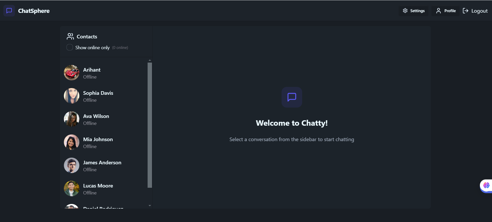
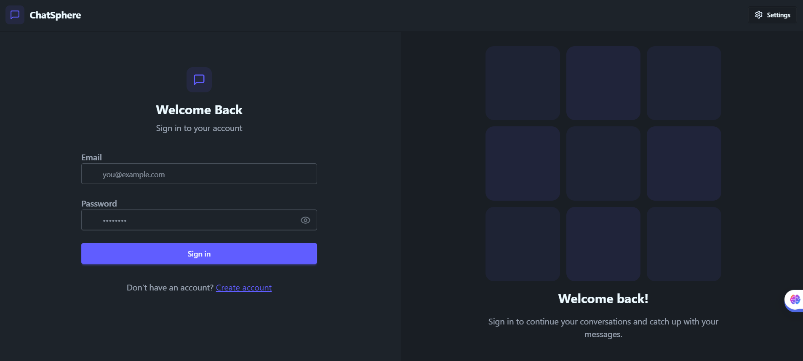
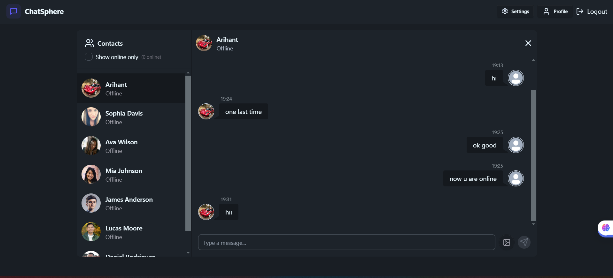

# ChatSphere - A Modern React Chat Application

ChatSphere is a modern chat application built with React and Vite, designed to provide a seamless user experience with real-time messaging capabilities.

## Project Information

- **Name**: ChatSphere
- **Version**: 1.0.0
- **Description**: 🚀 A Modern React Chat Application

## Features

- **User Authentication**: Secure login and signup functionality.
- **Dynamic Routing**: Navigate between different pages including Home, Profile, Settings, and more.
- **Responsive Design**: Optimized for both desktop and mobile devices.
- **Real-time Messaging**: Engage in real-time conversations with other users.
- **User Profiles**: Manage user settings and view profile information.

## Getting Started

To get a local copy up and running, follow these simple steps:

1. Clone the repository:

   ```bash
   git clone https://github.com/Arihant09x/ChatApp.git
   ```

2. Navigate to the project directory:

   ```bash
   cd ChatApp
   ```
3. Configure environment variables:

      - Create .env file in backend directories
      - Add necessary configurations (MONGO_URI, PORT,JWT_SECRET,CLOUDINARY_CLOUD_NAME,CLOUDINARY_API_KEY ,CLOUDINARY_API_SECRET.)
4. Install the dependencies:

   ```bash
   npm build
   ```

5. Start the development server:

   ```bash
   npm start
   ```

6. Open your browser and visit `http://localhost:5173` to see the application in action.

## Screenshots

### Home Page



### Login Page



### Chat page



## Usage

Once the application is running, you can:
- **Access the**: application at https://chatsphere-f5oi.onrender.com/login
- **Sign Up**: Create a new account to start chatting.
- **Log In**: Access your account and start messaging.
- **Navigate**: Use the navigation bar to access different sections of the app.

## Contributing

Contributions are welcome! Please feel free to submit a pull request or open an issue for any suggestions or improvements.

## License

This project is licensed under the MIT License - see the [LICENSE](LICENSE) file for details.

## Acknowledgements

- [Vite](https://vitejs.dev/) for the fast development experience.
- [React](https://reactjs.org/) for building user interfaces.
- [DaisyUI](https://daisyui.com/) for the beautiful UI components.
